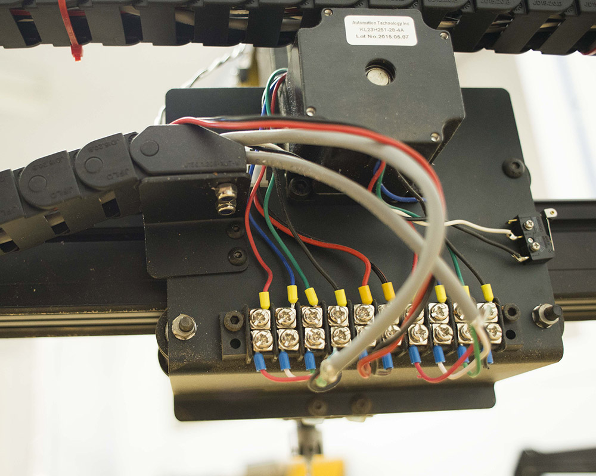

<h3 id="overview">
Overview</h3>

The drag chain assembly is very similar for the 500mm and 1000mm machines. The main difference is that the drag chain mounts and wraps horizontally on the 500mm machine and vertically on the 1000mm machine. As a result, the brackets that hold the drag chain are a little bit different and mount in slightly different ways.

Click below to select your chosen drag chain.

<a data-toggle="collapse" data-parent="#drag-chain-accordion" href="#500mm-drag-chain" aria-expanded="false" aria-controls="500mm-drag-chain" class="panel-heading" role="tab" id="500mm-drag-chain-header">

<h4 class="panel-title">
500mm Drag Chain

</h4>

<i class="fa fa-plus"></i>
 <i class="fa fa-minus"></i>

</a>

<h2>
<strong>X-CARVE UPDATE</strong></h2>
<strong>January 28, 2016</strong>

500mm Drag Chain Kits now include the same brackets and hardware as the 1000mm Drag Chain Kit. You'll still be using the same number of drag chain links, and the following is the updated bill of materials:

<table>
	<tr>
		<td style="color:#fff;background: #8a52a1;" colspan="3"><b>500mm Drag Chain Kit</b> </td>
	</tr>
	<tr>
		<td> <b>SKU</b> </td>
		<td> <b>Name</b> </td>
		<td> <b>Quantity</b> </td>
	</tr>
	<tr>
		<td> 30331-09 </td>
		<td> Drag Chain 27 Links </td>
		<td> 2 </td>
	</tr>
	<tr>
		<td> 30331-09 </td>
		<td> Drag Chain Female End Link (attached) </td>
		<td> 2 </td>
	</tr>
	<tr>
		<td> 30587-01 </td>
		<td> Drag Chain Gantry Bracket </td>
		<td> 1 </td>
	</tr>
	<tr>
		<td> 30586-01 </td>
		<td> Drag Chain Angle Bracket </td>
		<td> 2 </td>
	</tr>
	<tr>
		<td> 30586-02 </td>
		<td> Bracket  Drag Chain Extrusion Angle Bracket </td>
		<td> 1 </td>
	</tr>
	<tr>
		<td> 25281-05 </td>
		<td> T-Slot Nut M5 Pre-Assembly </td>
		<td> 2 </td>
	</tr>
	<tr>
		<td> 25286-24 </td>
		<td> Button Head Cap Screw M4 × 10mm </td>
		<td> 4 </td>
	</tr>
	<tr>
		<td> 25286-17 </td>
		<td> Button Head Cap Screw M5 × 8mm </td>
		<td> 2 </td>
	</tr>
	<tr>
		<td> 30554-01 </td>
		<td> Flat Head Socket Cap Screw M4 x 10mm </td>
		<td> 8 </td>
	</tr>
	<tr>
		<td> 30265-03 </td>
		<td> Nylon Insert Lock Nut M4 </td>
		<td> 10 </td>
	</tr>
</table>

This section will have a more comprehensive update in the near future. For the time being, please refer to the 1000mm Drag Chain Kit section, as well as the <a href="http://x-carve-instructions.inventables.com/step13/">Work Area section.</a>

<iframe width="560" height="315" style="padding-top:20px;" src="https://www.youtube.com/embed/RVQDwC8H6U4" frameborder="0" allowfullscreen>
</iframe>

<table>
	<tr>
		<td style="color:#fff;background: #8a52a1;" colspan="3"><b>500mm Drag Chain Kit</b> </td>
	</tr>
	<tr>
		<td> <b>SKU</b> </td>
		<td> <b>Name</b> </td>
		<td> <b>Quantity</b> </td>
	</tr>
	<tr>
		<td> 30331-09 </td>
		<td> Drag Chain 27 Links </td>
		<td> 2 </td>
	</tr>
	<tr>
		<td> 30331-09 </td>
		<td> Drag Chain Female End Link (attached) </td>
		<td> 2 </td>
	</tr>
	<tr>
		<td> 30527-01 </td>
		<td> Drag Chain Bracket </td>
		<td> 2 </td>
	</tr>
	<tr>
		<td> 30554-01 </td>
		<td> Flat Head Socket Cap Screw M4 x 10mm </td>
		<td> 4 </td>
	</tr>
	<tr>
		<td> 30265-03 </td>
		<td> Nylon Insert Lock Nut M4 </td>
		<td> 4 </td>
	</tr>
</table>

You should have two lengths of drag chain, each with one of the male end links removed. Note that it flexes in one direction and is stiff in the other direction.

Take one length of drag chain and snap it into the male end on your X Carriage. It should bend easily around to the left side of the machine. If it does not, unsnap it and flip it around. The 500mm drag chain will bend horizontally toward the back of your machine.

Take all of the wires that will travel with the X Carriage and thread them through the drag chain. It helps to tape the ends together with a piece of masking tape. It&#8217;s also much easier to thread wires through drag chain when the chain is straight.

<h3>X-Axis Bracket Assembly</h3>

Attach a female drag chain end to a drag chain bracket with two M4 flat head screws and two M4 nylock nuts.

<i class="fa fa-hand-o-right"></i>

<strong>Note:</strong> The female drag chain ends come attached to the 27 drag chain links and need to be removed in order to be installed on the drag chain bracket.

   

<h3>Mount Drag Chain Bracket</h3>

Attach the bracket you just assembled to the left Y-Plate. You&#8217;ll back out two of the thread forming screws that hold the X-Axis Makerslide to the Left Y-Plate. Back them out one at a time to install the bracket.

   

Snap the drag chain with all of the wires inside of it to the bracket you just mounted.

Take the second female drag chain end and attach to the second drag chain bracket just like the first one.

   

Install this bracket on the front left end plate using the thread forming screws. Again, back out one screw at a time to keep the machine supported while installing the bracket.

   

Snap the second length of drag chain on to the male bracket on the left Y-Plate.

Tape the wires that will travel with the Gantry to the bundle of wires that came through the X-Axis drag chain. Thread all wires through the Y-Axis drag chain.

Snap the drag chain into the female drag chain end on the front left end plate.

Your X-Carve should look like this:

<a data-toggle="collapse" data-parent="#drag-chain-accordion" href="#1000mm-drag-chain" aria-expanded="false" aria-controls="1000mm-drag-chain" class="panel-heading" role="tab" id="1000mm-drag-chain-header">

<h4 class="panel-title">
1000mm Drag Chain</h4>

<i class="fa fa-plus"></i>
 <i class="fa fa-minus"></i>

</a>

<table>
	<tr>
		<td style="color:#fff;background: #8a52a1;" colspan="3"><b>1000mm Drag Chain Kit</b> </td>
	</tr>
	<tr>
		<td> <b>SKU</b> </td>
		<td> <b>Name</b> </td>
		<td> <b>Quantity</b> </td>
	</tr>
	<tr>
		<td> 30331-10 </td>
		<td> Drag Chain 54 Links </td>
		<td> 1 </td>
	</tr>
	<tr>
		<td> 30331-10 </td>
		<td> Drag Chain Female End Link (attached) </td>
		<td> 1 </td>
	</tr>
	<tr>
		<td> 30587-01 </td>
		<td> Drag Chain Gantry Bracket </td>
		<td> 1 </td>
	</tr>
	<tr>
		<td> 30554-01 </td>
		<td> Flat Head Socket Cap Screw M4 x 10mm </td>
		<td> 2 </td>
	</tr>
	<tr>
		<td> 30265-03 </td>
		<td> Nylon Insert Lock Nut M4 </td>
		<td> 2 </td>
	</tr>
</table>

You should have two lengths of drag chain, each with one of the male end links removed. At this time you will be working with only one of the two lengths, and will use the second length during the Work Area section of the instructions.

Note that the drag chain flexes in one direction and is stiff in the other direction. The drag chain will bend vertically around the x-axis motor of your machine. Take the length of drag chain and snap it into the male end on your X Carriage. It should bend easily <strong>up and over to the left</strong> side of the machine (pictured at the end of this section). If it does not, unsnap it and flip it around.

Take all of the wires that will travel with the X Carriage and thread them through the drag chain. It helps to tape the ends together with a piece of masking tape. It&#8217;s also much easier to thread wires through drag chain when the chain is straight.

<h3>X-Axis Bracket Assembly</h3>

Attach a female drag chain end to a drag chain bracket with two M4 flat head screws and two M4 nylock nuts.

<i class="fa fa-hand-o-right"></i>

<strong>Note:</strong> The female drag chain end comes attached to the 54 drag chain links and needs to be removed in order to be installed on the drag chain bracket.

   

<h3>Mount Drag Chain Bracket</h3>

Attach the bracket you just assembled to the left Y-Plate. You&#8217;ll back out two of the thread forming screws that hold the X-Axis Makerslide to the Left Y-Plate. Back them out one at a time to install the bracket.

Snap the drag chain with all of the wires inside of it to the bracket you just mounted.

<i class="fa fa-hand-o-right"></i>

<strong>Note:</strong> <strong>Stop your drag chain assembly here.</strong> The remaining steps to install the drag chain will be detailed in the Work Area section when mounting the waste board.

