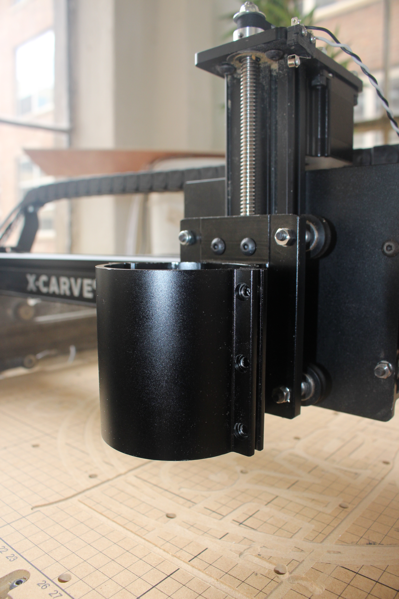
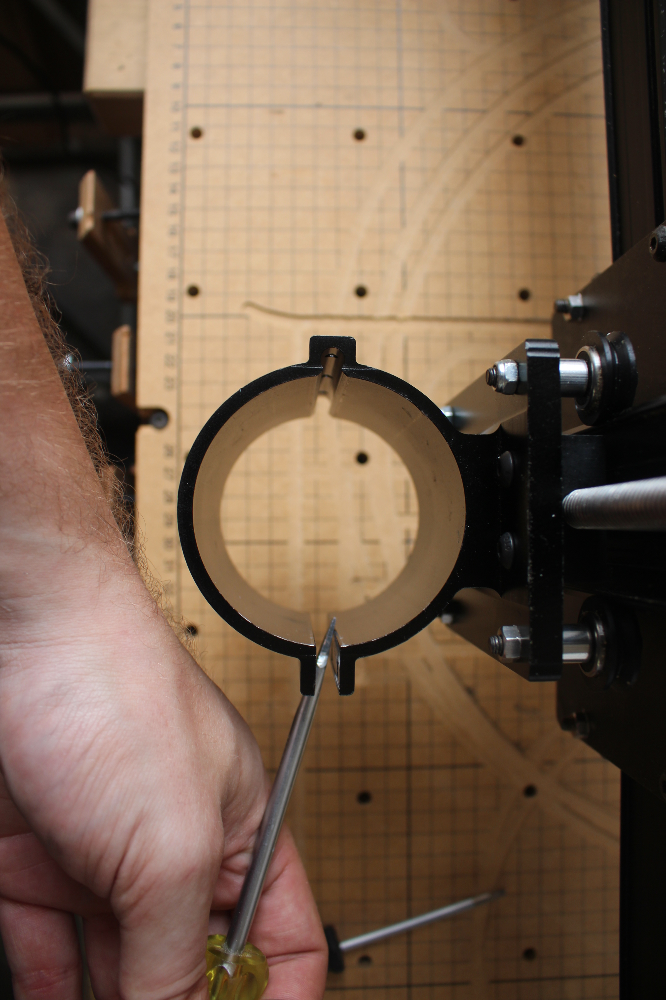
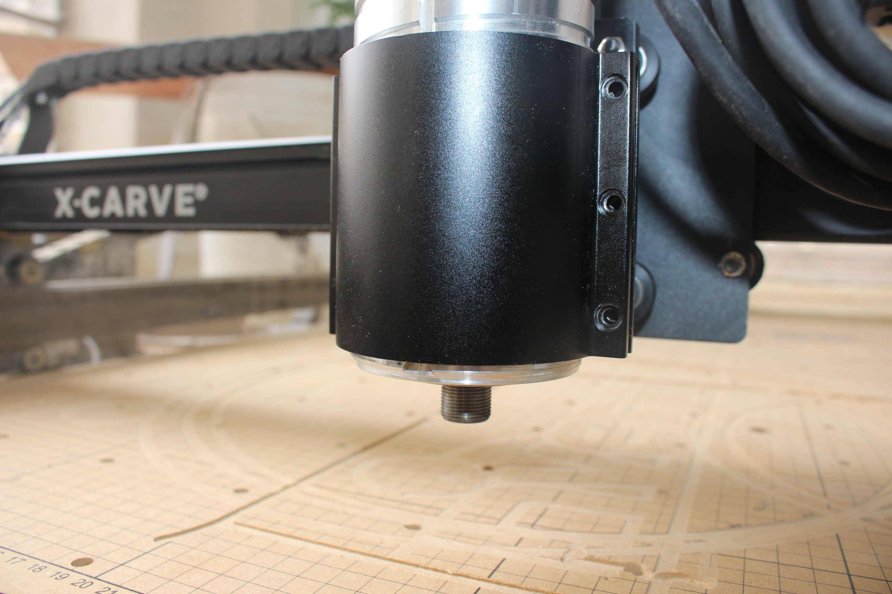

For mounting instructions, select your spindle choice below.

<a data-toggle="collapse" data-parent="#spindle-accordion" href="#spindle" aria-expanded="false" aria-controls="spindle" class="panel-heading" role="tab" id="spindle-header">

<h4 class="panel-title">
24V DC Spindle</h4>

<i class="fa fa-plus"></i>
 <i class="fa fa-minus"></i>

</a>

<iframe width="560" height="315" src="https://www.youtube.com/embed/Wz3ZoGK_HIk" frameborder="0" allowfullscreen></iframe>

<table>
	<tr>
		<td style="color:#fff;background: #42a44e;" colspan="3"><b>300W 24VDC Spindle Kit</b> </td>
	</tr>
	<tr>
		<td> <b>SKU</b> </td>
		<td> <b>Name</b> </td>
		<td> <b>Quantity</b> </td>
	</tr>
	<tr>
		<td> 30539-01 </td>
		<td> Spindle 24VDC </td>
		<td> 1 </td>
	</tr>
	<tr>
		<td> 30546-01 </td>
		<td> Spindle Carriage </td>
		<td> 1 </td>
	</tr>
	<tr>
		<td> 25285-33 </td>
		<td> Socket Head Cap Screw M4 x 10mm </td>
		<td> 3 </td>
	</tr>
</table>
<table>
	<tr>
		<td style="color:#fff;background: #383838;" colspan="3"><b>Core Components Kit</b> </td>
	</tr>
	<tr>
		<td> <b>SKU</b> </td>
		<td> <b>Name</b> </td>
		<td> <b>Quantity</b> </td>
	</tr>
	<tr>
		<td> 25203-01 </td>
		<td> Dual Bearing V-Wheel Kit </td>
		<td> 4 </td>
	</tr>
	<tr>
		<td> 25286-22 </td>
		<td> Button Head Cap Screw M5 x 35mm </td>
		<td> 4 </td>
	</tr>
	<tr>
		<td> 25286-18 </td>
		<td> Button Head Cap Screw M5 x 10mm </td>
		<td> 2 </td>
	</tr>
	<tr>
		<td> 30265-04 </td>
		<td> Nylon Insert Lock Nut M5 </td>
		<td> 2 </td>
	</tr>
	<tr>
		<td> 30158-01 </td>
		<td> Eccentric Nut M5 </td>
		<td> 2 </td>
	</tr>
	<tr>
		<td> 25312-23 </td>
		<td> Aluminum Spacer 5.1mm ID 9.5mm OD 9.5mm LG </td>
		<td> 4 </td>
	</tr>
</table>
<h3 id="attach-v-wheels">1. Attach the V-Wheels to the Spindle Carriage</h3>

You&#8217;ll start by putting V-Wheels followed by spacers onto the 35mm Button Head Cap Screws. put the screws through the backside of the Spindle Carriage and fasten them with nylock and eccentric nuts. Just like the X Carriage and Y-Plates, there are larger holes that are designed to accept the eccentric nuts.

   

<h3 id="attach-spindle-carriage">2. Attach the Spindle Carriage to the Drive Rod</h3>

Slide the V-Wheels onto the Z-Axis Makerslide. Move the Spindle Carriage up the Z-Axis until the Delrin Nut aligns with the mounting holes. Insert two M5 x 10mm Button Head Cap Screws through the plate and into the Delrin Nut. Tighten them alternately until they are both just past finger tight.

   

<h3 id="insert-spindle">3. Insert the Spindle</h3>

Put the Spindle into the Spindle Carriage. Make sure the spacer around the body of the Spindle stays flush with the bottom of the can. You may need to push with a little force to get the Spindle all of the way into the Spindle Carriage. Insert and alternately tighten the M4 x 10mm Low Profile Screws. You&#8217;ll want to tighten these screws firmly, but don&#8217;t over tighten to the point that your clamp is narrow image-rower at the top than at the bottom.

  

If you&#8217;re using terminal blocks to wire your machine put the ends of the <b>red</b> and <b>black</b> wires into the matching terminals of the 10 block terminal on the back of the X Carriage.

<a data-toggle="collapse" data-parent="#spindle-accordion" href="#dewalt-611" aria-expanded="false" aria-controls="dewalt-611" class="panel-heading" role="tab" id="dewalt-611-header">

<h4 class="panel-title">
Dewalt DWP611</h4>

<i class="fa fa-plus"></i>
 <i class="fa fa-minus"></i>

</a>

<table>
	<tr>
		<td style="color:#fff;background: #42a44e;" colspan="3"><b>DeWalt DWP611 Spindle Mount Kit</b> </td>
	</tr>
	<tr>
		<td> <b>SKU</b> </td>
		<td> <b>Name</b> </td>
		<td> <b>Quantity</b> </td>
	</tr>
	<tr>
		<td> 30621-01 </td>
		<td> DeWalt 611 Router </td>
		<td> 1 </td>
	</tr>
	<tr>
		<td> 30610-01 </td>
		<td> DeWalt 611 Spindle Carriage </td>
		<td> 1 </td>
	</tr>
	<tr>
		<td> 25285-46 </td>
		<td> Socket Head Cap Screw M4 x 16mm </td>
		<td> 3 </td>
	</tr>
	<tr>
		<td> 25286-25 </td>
		<td> Button Head Cap Screw M5 × 16mm </td>
		<td> 2 </td>
	</tr>
</table>
<table>
	<tr>
		<td style="color:#fff;background: #383838;" colspan="3"><b>Core Components Kit</b> </td>
	</tr>
	<tr>
		<td> <b>SKU</b> </td>
		<td> <b>Name</b> </td>
		<td> <b>Quantity</b> </td>
	</tr>
	<tr>
		<td> 25203-01 </td>
		<td> Dual Bearing V-Wheel Kit </td>
		<td> 4 </td>
	</tr>
	<tr>
		<td> 25286-22 </td>
		<td> Button Head Cap Screw M5 x 35mm </td>
		<td> 4 </td>
	</tr>
	<tr>
		<td> 30265-04 </td>
		<td> Nylon Insert Lock Nut M5 </td>
		<td> 2 </td>
	</tr>
	<tr>
		<td> 30158-01 </td>
		<td> Eccentric Nut M5 </td>
		<td> 2 </td>
	</tr>
	<tr>
		<td> 25312-23 </td>
		<td> Aluminum Spacer 5.1mm ID 9.5mm OD 9.5mm LG </td>
		<td> 4 </td>
	</tr>
</table>

    <i class="fa fa-hand-o-right"></i>
    
      <b>Note:</b> X-Carves are currently shipping with M4 x 16mm Socket Head Cap Screws.  Previous orders shipped with M4 x 10mm Socket Head Cap Screws and either should work well.
    

<h3 id="attach-v-wheels">Attach the V-Wheels to the Spindle Carriage</h3>

You&#8217;ll start by putting V-Wheels followed by spacers onto the 35mm Button Head Cap Screws. Put the screws through the backside of the Spindle Carriage and fasten them with nylock and eccentric nuts. Just like the X Carriage and Y-Plates, there are larger holes that are designed to accept the eccentric nuts.  Pictured below is the 24DC spindle carriage, however the installation process is the same for both spindles.

   

<h3 id="attach-spindle-carriage">Attach the Spindle Carriage to the Drive Rod</h3>

Slide the V-Wheels onto the Z-Axis Makerslide. Move the Spindle Carriage up the Z-Axis until the Delrin Nut aligns with the mounting holes. Insert two M5 x 16mm Button Head Cap Screws through the plate and into the Delrin Nut. Tighten them alternately until they are both just past finger tight.  Some of the images below show the 24DC spindle carriage, however the installation process is the same for both spindles.

   

The fit between the router and your mount will be snug. You can use a flat head screw driver to gently pry the clamp open in order to insert your router.

Be sure that the router body sticks out at least 1/4&quot; from the bottom of the mount.

Alternately tighten the M4 Socket Head Cap Screws to clamp the router into the mount with even pressure. These screws should be tight, but it is possible to strip the threads in the mount so do not overtighten.

The housing of your router may just touch your Z-Plate during a homing cycle. Do not worry this will not affect your homing cycle or your Z-Axis movement.

<a data-toggle="collapse" data-parent="#spindle-accordion" href="#dewalt-dw660" aria-expanded="false" aria-controls="dewalt-dw660" class="panel-heading" role="tab" id="dewalt-dw660-header">

<h4 class="panel-title">
Dewalt DW660</h4>

<i class="fa fa-plus"></i>
 <i class="fa fa-minus"></i>

</a>

<h3>
Mounting DeWalt DW660</h3>

<iframe width="560" height="315" src="https://www.youtube.com/embed/VGZ3SmE7gsA" frameborder="0" allowfullscreen>
</iframe>

<a data-toggle="collapse" data-parent="#spindle-accordion" href="#bosch-colt" aria-expanded="false" aria-controls="bosch-colt" class="panel-heading" role="tab" id="bosch-colt-header">

<h4 class="panel-title">
Bosch Colt</h4>

<i class="fa fa-plus"></i>
 <i class="fa fa-minus"></i>

</a>

<h3>
Mounting Bosch Colt</h3>

<iframe width="560" height="315" src="https://www.youtube.com/embed/Raty-ijFP0c" frameborder="0" allowfullscreen>
</iframe>

<a data-toggle="collapse" data-parent="#spindle-accordion" href="#quiet-cut" aria-expanded="false" aria-controls="quiet-cut" class="panel-heading" role="tab" id="quiet-cut-header">

<h4 class="panel-title">
Quiet Cut Spindle</h4>

<i class="fa fa-plus"></i>
 <i class="fa fa-minus"></i>

</a>

<h3>
Mounting Quiet Cut Spindle</h3>

<iframe width="560" height="315" src="https://www.youtube.com/embed/HQoC_W6kdV0" frameborder="0" allowfullscreen>
</iframe>

