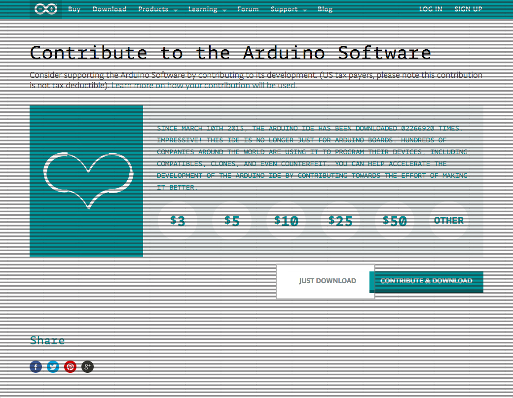

Select your computer&#8217;s operating system.

  

    <a aria-controls="windows" aria-expanded="false" class="panel-heading" data-parent="#os-accordion" data-toggle="collapse" href="#windows" id="windows-header" role="tab">
    <h4 class="panel-title">Windows</h4>
    

      <i class="fa fa-plus"></i> <i class="fa fa-minus"></i>
    
</a>
    

      

        
        
To control your newly assembled X-Carve, head on over to the Arduino homepage and click on the &#8220;Download&#8221; button. Downloading these drivers are necessary to allow communication between your PC and Arduino.

        
Select your computer&#8217;s operating system by clicking on &#8220;Windows Installer.&#8221;

        
We encourage you to contribute to the Arduino Software, however you can start your download immediately by clicking on &#8220;Just Download.&#8221; 

        
Certain versions of Windows require you to manually assign the drivers to the Arduino. Follow the directions above if you are using Windows 7, Vista, or XP.

        
<i class="fa fa-hand-o-right"></i> <strong>DO NOT</strong> load a sketch from the arduino IDE or else the pre-loaded machine firmware will be wiped from the Arduino.
<a class="btn btn-invent btn-animate-arrow" href="http://www.arduino.cc/" target="_blank">Get Arduino Software</a>
      

    

  

  

    <a aria-controls="mac" aria-expanded="false" class="panel-heading" data-parent="#os-accordion" data-toggle="collapse" href="#mac" id="mac-header" role="tab">
    <h4 class="panel-title">Mac</h4>
    

      <i class="fa fa-plus"></i> <i class="fa fa-minus"></i>
    
</a>
    

      

        You don&#8217;t need to install any drivers to connect to your machine. Hooray!
      

    

  

